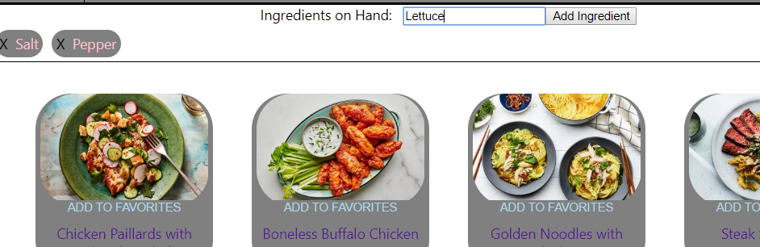
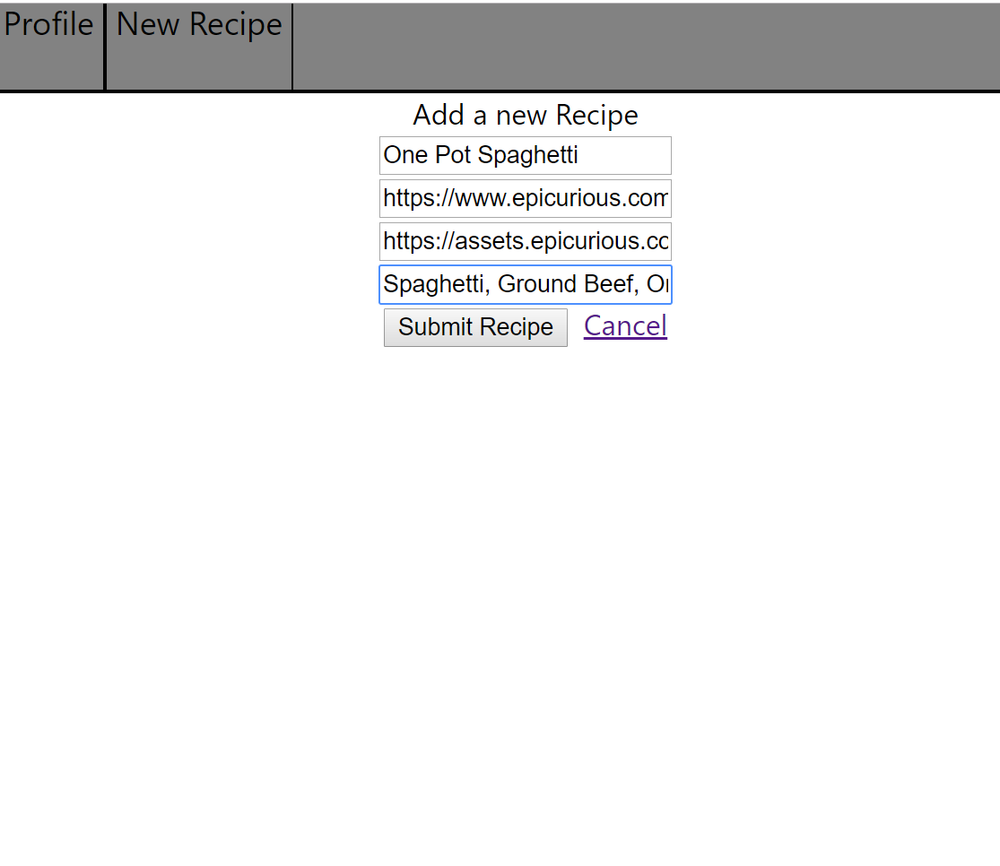

# FOOD

Food. We all need it, we all eat it, but the average person throws away 300 lbs of food a year, valued at almost $2200. Food is designed to help make cooking more efficient by finding recipes for the food that you already have in your house.

With FOOD, you can add your favorite recipes and search other's by the ingredients you already have, saving yourself money and shopping time.

## Technologies Used

This game some of the following languages, and should be supported in most browsers:
1. HTML
1. CSS
1. Javascript
1. Node.js
1. Express
1. ReactJS
1. MongoDB
1. Mongoose

## Development issues

During the development of Pickups, the dev team decided to roll out certain features in future updates to make sure the current user experience is bug free.

1. Our original plan was to rely on a 3rd party API that had a thorough database of recipes and various other nutritional facts, however it was limited in the types of calls and queries we could make. We opted instead to create and store our own recipes in a Mongo database, and query those instead. In the future we plan on expanding the models to allow more query options to users, including various nutritional data.
1. Not using the 3rd party API cut into the time we had to perfect other features. Our user profile did not get expanded or flushed out like originally planned to include a user's nutritional preferences, or their stock pantry items that are included in every search. Additionally we were not able to add in various search filters to the search function to better refine a user's results.

## Find your next game here!

You can FOOD here. Please feel free to add your favorite recipes, and stay tuned for more features coming soon!

https://stark-sierra-34176.herokuapp.com/

## Future Plans

As we expand we want to more better refine the search results for the user to better find the type of food they're looking for. Additionally, we will be expanding the user profile to include more personalized results based on pre-selected criteria by the user.
